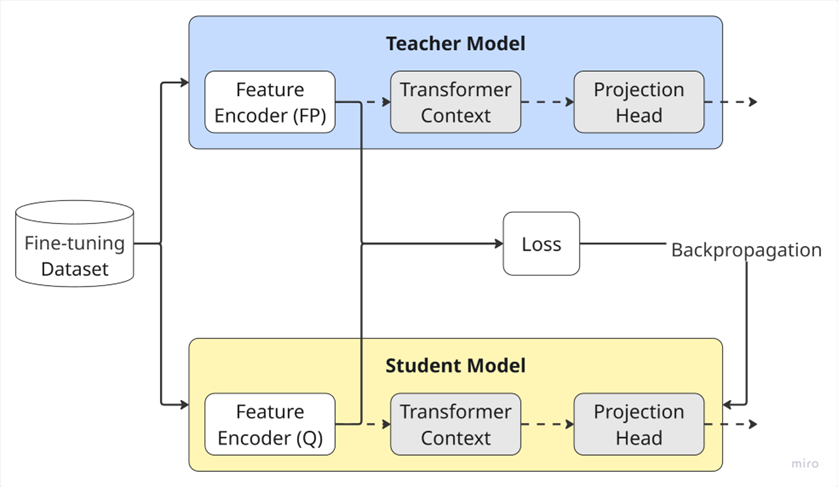

# AudioTransformerQuantization
Quantization experiments on Transformer-based models (Wav2Vec 2.0) in Audio Classification/Automatic Speech Recognition tasks.

We applied insights from experiments on [M5 deep CNNs](https://github.com/Bozhi-Lyu/DeepCNN-Quantization-Experiments) to quantize Wav2Vec 2.0 and leverage Quantization awareness training (**QAT**) and **Knowledge Distillation** to keep accuracy drop **under 4%**.

## Resources
- Deep CNNs: [M5](https://arxiv.org/abs/1610.00087) architecture implemented in [this repo](https://github.com/Bozhi-Lyu/DeepCNN-Quantization-Experiments).
- Defense slides: [Google Drive](https://drive.google.com/file/d/17BxSuDDCx9pzQQlLe6eWYmLw2AXoSz6g/view?usp=sharing).
- Thesis: [Google Drive](https://drive.google.com/file/d/1MZp0lH_i9IodTItexvLTvB1h5W3rgs3d/view?usp=sharing).
